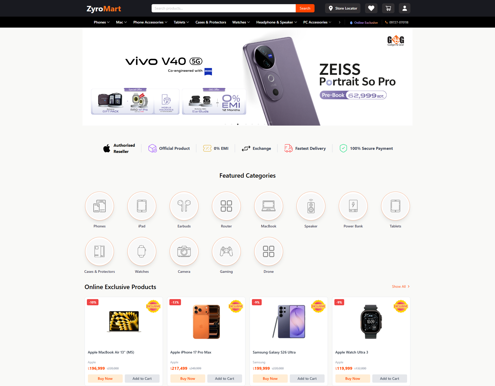
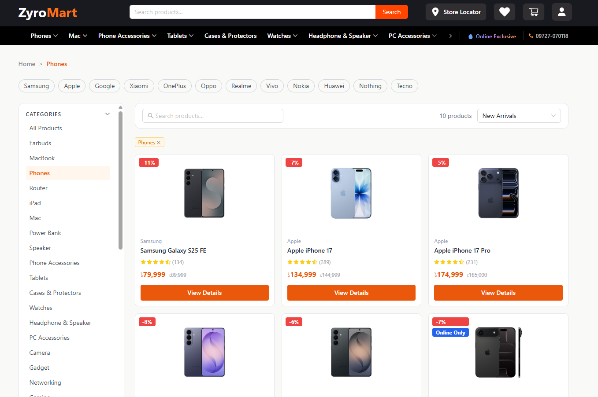
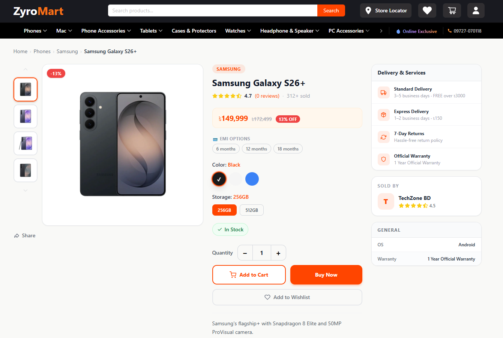

# ZyroMart — Multi Vendor eCommerce Frontend


A modern, responsive multi-vendor e-commerce storefront built with **React 18**, **Vite**, and **Tailwind CSS**. Ships three separate role-based experiences — a full customer storefront, a vendor management dashboard, and an admin control panel — in a single application.

> **Part of the ZyroMart full-stack project.** See the [Backend Repository](https://github.com/Sakib-Atreus/ZyroMart-server) for the Node.js + Express API.

---

## Table of Contents

- [Screenshots](#screenshots)
- [Key Highlights](#key-highlights)
- [Tech Stack](#tech-stack)
- [Features](#features)
- [Getting Started](#getting-started)
- [Environment Variables](#environment-variables)
- [Project Structure](#project-structure)
- [Routing](#routing)
- [State Management](#state-management)
- [API Integration](#api-integration)
- [Scripts](#scripts)

---

## Screenshots

### Storefront

| Home Page | Product Listing | Product Detail |
|:---:|:---:|:---:|
|  |  |  |

### Shopping Experience

| Cart | Checkout | Order Success |
|:---:|:---:|:---:|
|  |  |  |

### Admin Dashboard

| Analytics Overview | Vendor Management | Product Moderation |
|:---:|:---:|:---:|
|  |  |  |

### Vendor Dashboard

| Vendor Analytics | My Products | Order Tracking |
|:---:|:---:|:---:|
|  |  |  |

---

## Key Highlights

- **Three distinct dashboards in one app** — customer storefront, vendor panel, and admin control panel, each with its own layout, routing, and role guard.
- **Dual payment gateway** — Stripe for international cards, SSLCommerz for Bangladeshi banks and mobile money. Payment selection at checkout with per-gateway success/cancel handling.
- **Context-only state management** — no Redux or Zustand needed. `AuthContext` and `CartWishlistContext` cover all cross-component state while keeping the bundle lean.
- **Axios interceptors** handle auth token injection, 401 auto-redirect to login, 403 toast feedback, and server error toasts centrally — components never deal with auth plumbing.
- **Framer Motion** animations on page transitions, modals, and interactive components without layout jank.
- **Recharts** powers all analytics charts (revenue, orders, top products) in both admin and vendor dashboards.
- **Fully responsive** — Tailwind CSS mobile-first utilities with DaisyUI component layer and Ant Design for data-heavy UI (tables, forms, drawers).
- **Role-based route protection** — `PrivateRoute`, `AdminRoute`, and `VendorRoute` guards with redirect to login on 401 and access-denied feedback on 403.

---

## Tech Stack

| Layer | Technology |
|---|---|
| Framework | React 18.3 |
| Build Tool | Vite 5.4 |
| Language | JavaScript (ES2022+) |
| Styling | Tailwind CSS 3.4 + DaisyUI 4.12 |
| Component Library | Ant Design 5.x |
| Routing | React Router DOM 6.x |
| HTTP Client | Axios 1.x |
| Animation | Framer Motion 11.x |
| Charts | Recharts 3.x |
| Carousels | React Slick |
| Maps | React Google Maps API |
| Notifications | React Toastify |
| Sliders | rc-slider |
| Icons | FontAwesome + React Icons |
| Social Sharing | React Share |

---

## Features

### Customer Experience
- Product browsing with search and multi-faceted filtering
- Product detail pages with variant selection (size, color, etc.)
- Image galleries and similar product recommendations
- Star ratings and written reviews
- Product Q&A — ask questions, read vendor answers
- Persistent server-side shopping cart
- Wishlist management
- Checkout with address entry
- Payment via **Stripe** (international cards) or **SSLCommerz** (Bangladeshi banks / mobile money)
- Order history with status tracking
- Order cancellation
- Profile management and password change

### Admin Dashboard
- Platform analytics: revenue, users, orders, vendors
- Category management (create, edit, delete, nested categories)
- Vendor application review and approval workflow
- Product moderation (activate / deactivate listings)
- Order monitoring across all vendors
- Admin-to-vendor messaging

### Vendor Dashboard
- Vendor-specific analytics: own revenue, orders, top products
- Product listing management (CRUD + variant management)
- Order tracking for own sales
- Shop settings (name, logo, description)
- Vendor-to-admin messaging
- Answer customer Q&A on own products

### General
- JWT-based authentication with automatic 401 handling
- Role-based protected routes (`user`, `vendor`, `admin`)
- Responsive design — mobile first via Tailwind CSS
- Toast notifications for all async feedback
- Smooth page and component animations via Framer Motion

---

## Getting Started

### Prerequisites

- Node.js v18+
- The ZyroMart backend running at `http://localhost:5000` (or set `VITE_API_BASE_URL`)

### Installation

```bash
# Clone the repository
git clone https://github.com/Sakib-Atreus/ZyroMart-client
cd ZyroMart-client

# Install dependencies
npm install

# Copy environment file
cp .env.example .env
# Fill in your values (see Environment Variables below)
```

### Running the App

```bash
# Development server with hot reload
npm run dev
```

Open [http://localhost:5173](http://localhost:5173) in your browser.

```bash
# Production build
npm run build

# Preview the production build locally
npm run preview
```

---

## Environment Variables

Create a `.env` file at the project root:

```env
# Backend API base URL
VITE_API_BASE_URL=

# Google Maps
VITE_GOOGLE_MAPS_API_KEY=your_google_maps_api_key
```

---

## Project Structure

```
ZyroMart-client/
├── public/
├── screenshots/               # ← Place your screenshots here
├── src/
│   ├── main.jsx               # App entry point — mounts providers
│   ├── App.jsx                # Root component
│   │
│   ├── api/
│   │   ├── axios.js           # Axios instance + request/response interceptors
│   │   └── endpoints.js       # API call wrappers for all modules
│   │
│   ├── context/
│   │   ├── AuthContext.jsx    # User auth state + login/logout actions
│   │   └── CartWishlistContext.jsx  # Cart & wishlist counts + refresh
│   │
│   ├── routes/
│   │   ├── Routes.jsx         # Main router configuration
│   │   ├── PrivateRoutes.jsx  # Require any authenticated user
│   │   ├── AdminRoute.jsx     # Require admin role
│   │   └── VendorRoute.jsx    # Require vendor role
│   │
│   ├── layout/
│   │   ├── Main.jsx           # Public/customer layout (navbar + footer)
│   │   ├── AdminLayout.jsx    # Admin sidebar layout
│   │   └── VendorLayout.jsx   # Vendor sidebar layout
│   │
│   ├── pages/
│   │   ├── Home/              # Landing page (banners, featured products)
│   │   ├── Phones/            # Product listing with filters
│   │   ├── Login/
│   │   ├── Register/
│   │   ├── Profile/
│   │   ├── Cart/
│   │   ├── Wishlist/
│   │   ├── Checkout/
│   │   │   ├── index.jsx      # Checkout form + payment method selection
│   │   │   ├── Success.jsx    # Post-payment success page
│   │   │   └── Cancel.jsx     # Payment cancelled page
│   │   ├── Admin/
│   │   │   ├── Dashboard/
│   │   │   ├── Categories/
│   │   │   ├── Vendors/
│   │   │   ├── Products/
│   │   │   ├── Orders/
│   │   │   └── Chat/
│   │   └── Vendor/
│   │       ├── Dashboard/
│   │       ├── MyProducts/
│   │       ├── Orders/
│   │       ├── ShopSettings/
│   │       └── Chat/
│   │
│   ├── components/
│   │   ├── ChatWidget/        # Floating AI-powered chat widget
│   │   ├── WelcomeModal/      # Promotional welcome modal on home page
│   │   └── PhoneDetails/      # Product detail view with variants, reviews, Q&A
│   │
│   ├── assets/                # Images, videos, static media
│   ├── utils/                 # Helper functions
│   ├── shared/                # Shared UI (Navbar, Footer)
│   └── providers/             # Context providers wrapper
│
├── index.html
├── vite.config.js
├── tailwind.config.js
├── postcss.config.js
├── .env.example
└── package.json
```

---

## Routing

### Public Routes

| Path | Page | Description |
|---|---|---|
| `/` | Home | Landing page with banners, featured products, and promotions |
| `/phones` | Product Listing | Browse, search, and filter all products |
| `/products/:slug` | Product Detail | Full product page with variants, reviews, and Q&A |
| `/cart` | Cart | Shopping cart |
| `/login` | Login | Email + password login |
| `/register` | Register | New account creation |
| `/about` | About | Company information |
| `/faq` | FAQ | Frequently asked questions |
| `/careers` | Careers | Job listings |
| `/contact` | Contact | Contact form and details |
| `/storeLocations` | Store Locations | Map view of physical stores |
| `/privacy-policy` | Privacy Policy | Legal privacy policy |
| `/terms` | Terms of Service | Terms and conditions |

### Private Routes (require login)

| Path | Page | Description |
|---|---|---|
| `/profile` | Profile | View and edit user profile, change password |
| `/wishlist` | Wishlist | Saved products |
| `/checkout` | Checkout | Enter address, select payment method |
| `/checkout/success` | Success | Post-payment confirmation |
| `/checkout/cancel` | Cancel | Cancelled payment message |

### Admin Routes (require `admin` role)

| Path | Page | Description |
|---|---|---|
| `/admin` | Dashboard | Platform analytics overview |
| `/admin/categories` | Categories | Create, edit, delete product categories |
| `/admin/vendors` | Vendors | Review applications, approve or suspend vendors |
| `/admin/products` | Products | View and moderate all product listings |
| `/admin/orders` | Orders | Monitor all orders across all vendors |
| `/admin/chat` | Chat | Message vendors |

### Vendor Routes (require `vendor` role)

| Path | Page | Description |
|---|---|---|
| `/vendor` | Dashboard | Own revenue and sales analytics |
| `/vendor/products` | My Products | Manage own product listings and variants |
| `/vendor/orders` | Orders | Track own incoming orders |
| `/vendor/settings` | Shop Settings | Update shop name, logo, and description |
| `/vendor/chat` | Chat | Message the platform admin |

---

## State Management

State is managed with React Context API — no external state library required.

### AuthContext (`src/context/AuthContext.jsx`)

| Export | Type | Description |
|---|---|---|
| `user` | object \| null | Current authenticated user (persisted to localStorage) |
| `token` | string \| null | JWT access token |
| `isAdmin` | boolean | Computed from `user.role === 'admin'` |
| `isVendor` | boolean | Computed from `user.role === 'vendor'` |
| `login(userData, token)` | function | Stores user and token, initialises cart/wishlist |
| `logout()` | function | Calls backend logout, clears localStorage and context |

### CartWishlistContext (`src/context/CartWishlistContext.jsx`)

| Export | Type | Description |
|---|---|---|
| `cartCount` | number | Total items in cart |
| `wishlistCount` | number | Total items in wishlist |
| `refreshCart()` | function | Sync cart count from server |
| `refreshWishlist()` | function | Sync wishlist count from server |

Counts are auto-synced on login and cleared on logout.

---

## API Integration

### Axios Instance (`src/api/axios.js`)

A pre-configured Axios instance handles all API communication.

**Base URL:** `VITE_API_BASE_URL` (default: `http://localhost:5000/api/v1`)

**Request interceptor:** Automatically attaches `Authorization: <token>` from localStorage to every outgoing request.

**Response interceptor:**

| Status | Behavior |
|---|---|
| 401 Unauthorized | Clears token and user, redirects to `/login` |
| 403 Forbidden | Shows "No access" toast notification |
| 500+ Server Error | Shows "Server error" toast notification |
| Validation errors | Extracts first field error and shows a descriptive toast |

### API Endpoints (`src/api/endpoints.js`)

| Group | Functions |
|---|---|
| `authApi` | `login`, `signup`, `logout`, `changePassword` |
| `userApi` | `getMe`, `updateMe`, `adminList`, `dashboard` |
| `categoryApi` | `list`, `featured`, `get(slug)`, `create`, `update`, `remove` |
| `vendorApi` | `list`, `apply`, `me`, `updateMe`, `changeStatus`, `adminList`, `adminCreate` |
| `productApi` | `list(params)`, `getBySlug`, `create`, `update`, `remove`, `changeStatus`, `vendorMe`, `newArrivals`, `topSelling`, `onlineExclusive`, `similar(id)` |
| `variantApi` | `byProduct(productId)`, `create`, `bulk`, `update`, `remove` |
| `orderApi` | `listAll`, `listMine`, `vendorMine`, `get(id)`, `create`, `cancel`, `updateStatus` |
| `cartApi` | `get`, `addItem`, `updateItem(variantId)`, `removeItem`, `clear` |
| `paymentApi` | `createCheckoutSession`, `createSSLCSession` |
| `wishlistApi` | `get`, `add`, `remove`, `clear` |
| `reviewApi` | `listByProduct`, `myReviewForProduct`, `create`, `update`, `remove` |
| `questionApi` | `listByProduct`, `create`, `answer`, `remove` |
| `analyticsApi` | `platform`, `vendor` |
| `chatApi` | `sendMessage`, `myConversation`, `listConversations`, `adminSend`, `getMessages` |

---

## Scripts

| Command | Description |
|---|---|
| `npm run dev` | Start Vite development server with HMR |
| `npm run build` | Build for production (outputs to `dist/`) |
| `npm run preview` | Locally preview the production build |
| `npm run lint` | Run ESLint across the project |

---

## Contributing

Contributions are welcome from authorized collaborators. Please follow the process below to keep the codebase clean and consistent.

### Branching Strategy

```
main          — production-ready code only
develop       — integration branch for completed features
feature/*     — new features (branched from develop)
fix/*         — bug fixes (branched from develop)
hotfix/*      — critical production fixes (branched from main)
```

### Workflow

1. **Fork or branch** — create a branch from `develop` using the naming convention above.
2. **Write your code** — place new pages under `src/pages/`, reusable components under `src/components/`, and new API call groups in `src/api/endpoints.js`.
3. **Lint before committing** — run `npm run lint` and resolve all warnings.
4. **Test in the browser** — verify the golden path and any edge cases (empty states, loading states, error states) before opening a pull request. Check both desktop and mobile screen sizes.
5. **Commit clearly** — use short, imperative commit messages:
   - `feat: add product comparison page`
   - `fix: cart count not resetting on logout`
   - `style: update checkout form spacing on mobile`
6. **Open a pull request** — target the `develop` branch. Describe what changed, which pages or components are affected, and include screenshots for any UI changes.
7. **Review** — at least one maintainer approval is required before merging.

### Code Standards

- Use functional components and React hooks — no class components.
- Keep components small and focused; extract reusable UI into `src/components/` or `src/shared/`.
- All API calls must go through the functions defined in `src/api/endpoints.js` — do not call Axios directly from pages.
- Use Tailwind utility classes for styling; avoid inline `style` props unless animating with Framer Motion.
- Do not commit `.env` files, API keys, or the `dist/` build output.

---

## Contact

For questions about this project, integration support, or business enquiries, please reach out through the following channel.

| Type | Details |
|---|---|
| **Email** | [sakibmia0718@gmail.com](mailto:sakibmia0718@gmail.com) |

> For bug reports or feature requests related to the codebase, open an issue in the project repository with a clear description, steps to reproduce (if a bug), and any relevant screenshots or screen recordings.

Response time is typically within 1–2 business days.

---

## License

This project is proprietary. All rights reserved. Unauthorized copying, distribution, or modification of this software is strictly prohibited.
